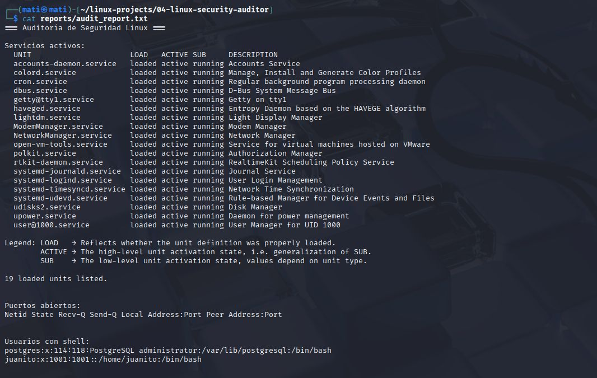
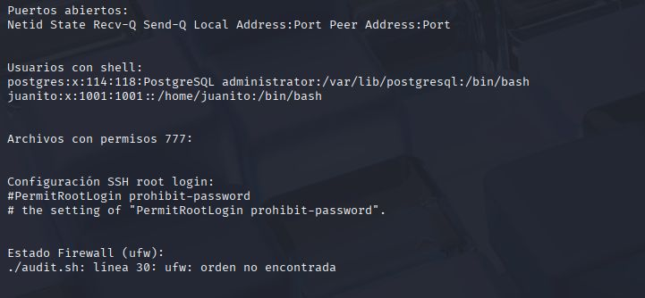

# 🛡️ Linux Security Auditor  
### (Auditor de Seguridad Linux)

---

## 🧠 Overview / Descripción  

**EN:**  
Security auditing tool for Linux systems that automates the collection and analysis of critical configurations, generating comprehensive reports for vulnerability detection and hardening.  

**ES:**  
Herramienta de auditoría de seguridad para sistemas Linux que automatiza la recopilación y el análisis de configuraciones críticas, generando reportes completos para la detección de vulnerabilidades y el refuerzo del sistema.

---

## 📋 Description / Descripción Detallada  

**EN:**  
This project is a set of **Bash and Python scripts** that perform a complete security audit on Linux systems, checking:  

- Active services and potential security risks  
- Open and listening ports  
- Users with shell access  
- Files with insecure permissions (**777**)  
- SSH root access configuration  
- Firewall (**UFW**) status  

The result is a detailed report that allows quick identification of vulnerabilities and insecure configurations.  

**ES:**  
Este proyecto es un conjunto de **scripts en Bash y Python** que realiza una auditoría completa de seguridad en sistemas Linux, verificando:  

- Servicios activos y posibles riesgos de seguridad  
- Puertos abiertos y en escucha  
- Usuarios con acceso a shell  
- Archivos con permisos inseguros (**777**)  
- Configuración de acceso SSH root  
- Estado del firewall (**UFW**)  

El resultado es un reporte detallado que permite identificar rápidamente vulnerabilidades y configuraciones inseguras en entornos Linux.

---

## 📂 Project Structure / Estructura del Proyecto  

├── audit.sh # Main Bash script that runs the audit / Script principal Bash que ejecuta la auditoría
├── analyze_service.py # Python script to analyze insecure services / Analiza servicios inseguros
├── check_permissions.py # Detects files with 777 permissions / Detecta archivos con permisos 777
├── report_generator.py # Generates audit reports / Genera reportes de auditoría
├── final_report.py # (Optional) Consolidates all reports / Consolida reportes (opcional)
├── tmp/ # Temporary files / Archivos temporales
└── reports/ # Final audit reports / Reportes finales

---

## ⚙️ Requirements / Requisitos  

| Requirement (EN) | Requisito (ES) |
| ---------------- | -------------- |
| Linux system (Kali, Ubuntu, Debian, etc.) | Sistema Linux (Kali, Ubuntu, Debian, etc.) |
| Python 3.7+ | Python 3.7 o superior |
| UFW installed (for firewall check) | UFW instalado (para verificación de firewall) |
| Execution permissions for Bash and Python scripts | Permisos de ejecución para scripts Bash y Python |

---

## ▶️ Usage / Ejecución  

**EN:**  
Grant execution permissions to the main script:  
bash
chmod +x audit.sh

Run the audit:

./audit.sh

Check the generated report in:

reports/audit_report.txt

**ES:**
Otorga permisos de ejecución al script principal:

chmod +x audit.sh

Ejecuta la auditoría:

./audit.sh

Consulta el reporte generado en:

reports/audit_report.txt

## 📸 Screenshots / Capturas  

### 🔍 Running the Audit / Ejecutando la Auditoría  

  

---

### 🧾 Generated Report / Reporte Generado  

  

📘 Notes / Notas

EN:
This project is part of the Linux Automation & Security Toolkit Series, focused on automation and auditing for system administrators and cybersecurity professionals.

ES:
Este proyecto forma parte de la serie Linux Automation & Security Toolkit, enfocada en automatización y auditoría para administradores de sistemas y profesionales de ciberseguridad.

👨‍💻 Developed by / Desarrollado por Matías Lagos Barra — Cloud & DevSecOps Engineer

